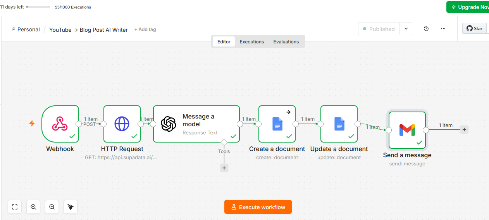

# 🎬 YouTube → Blog Post AI Writer — n8n + OpenAI Automation

## What This Does

I built this because content creators were stuck in a painful loop.

They would spend hours creating a YouTube video.
Then spend another 2 hours writing a blog post about it.
Same content. Double the work. Every single time.

So I automated the whole thing.

Now when you give this workflow a YouTube URL,
four things happen automatically — without you touching anything:

- The video transcript gets extracted instantly
- AI reads the transcript and writes a full engaging blog post
- The blog post saves directly to your Google Docs
- You get an email notification that your post is ready

You make the video.
The automation writes the blog post.
Done in under 30 seconds.

---

## The Problem I Solved

I talked to YouTubers, coaches and content creators.

They all said the same thing.

"I know I should repurpose my videos into blog posts."
"But writing takes so long I never get around to it."
"My YouTube content just sits there with no SEO value."

One creator told me she had 200 YouTube videos
and zero blog posts.
Two years of content doing nothing for her Google rankings.

This workflow changes that completely.
Every video becomes a blog post.
Every blog post builds SEO.
Zero extra writing time.

---

## How It Works

No coding. No complicated setup.
Just send a YouTube URL and watch it work.

Step 1 — You send a YouTube video URL
Just paste the URL. That is all you do.
The rest happens automatically.

Step 2 — The transcript gets extracted
Supadata API reads every word spoken in the video.
Language does not matter. It handles them all.

Step 3 — OpenAI reads the transcript and writes a blog post
Not a robotic summary.
A real engaging blog post that sounds like a person wrote it.
With a catchy headline. With sections. With a conclusion.
Something people actually want to read.

Step 4 — Blog post saves to Google Docs
Clean. Formatted. Ready to review and publish.
You just read it, make any small edits you want, and post it.

Step 5 — You get an email notification
Your blog post is ready and waiting.
No checking. No waiting. Just a notification.

Under 30 seconds from URL to finished blog post.
Every single time.

---

## Workflow Screenshot



---

## Flow Diagram

```
YouTube URL Received
        ↓
Extract Video Transcript
        ↓
OpenAI Writes Blog Post
        ↓
Create Google Doc
        ↓
Add Blog Post Content
        ↓
Email Notification Sent
        ↓
Done ✅
```

---

## The Nodes I Used

### Node 1 — Webhook
Receives the YouTube URL from you or any external tool.
The moment a URL arrives, the workflow starts working.
Simple. Instant. Always ready.

### Node 2 — HTTP Request (Supadata API)
Connects to Supadata to extract the video transcript.
Sends the YouTube URL. Gets back every word spoken in the video.
Works for any public YouTube video in any language.

### Node 3 — OpenAI (Message a Model)
The heart of the whole system.
Reads the full transcript.
Writes a complete blog post that sounds genuinely human.
Not templated. Not robotic. Real writing with real personality.
Model used: GPT-4o-mini — fast, smart, costs almost nothing.

### Node 4 — Google Docs (Create a document)
Creates a new Google Doc with today's date as the title.
Clean. Organised. Easy to find.

### Node 5 — Google Docs (Update a document)
Adds the full blog post content into the document.
Everything formatted and ready to review.
You just open it and read it.

### Node 6 — Gmail (Send notification)
Tells you your blog post is ready.
You get the email. You open Google Docs. You publish.
That simple.

---

## What I Learned Building This

I want to be honest about every mistake I made.
Because that is how you know I actually built this.

Mistake 1 — I put the API key in query parameters.
Got a 401 Unauthorized error from Supadata.
Fix: API key must go in the request Headers as x-api-key.

Mistake 2 — I thought Google Docs Create node had a Content field.
It does not. Documents were created completely empty.
Fix: You need two nodes. Create first. Then Update to add content.

Mistake 3 — I used Test URL in production.
Workflow stopped working the moment I closed n8n.
Fix: Always Publish the workflow and use Production URL.

Mistake 4 — Expression was returning undefined in Google Docs.
I was referencing the wrong node name.
Fix: Use $('Message a model').item.json.output[0].content[0].text

Every mistake I made, I fixed.
So you never have to face them.

---

## Who Needs This

- YouTubers who want blog posts without the writing work
- Content creators who want to build SEO from their videos
- Marketing agencies managing multiple client YouTube channels
- Coaches and consultants who teach through video
- Anyone sitting on a library of YouTube videos with no written content

---

## Real Questions From Real Buyers

**Does it work for any YouTube video?**
Any public YouTube video works perfectly.
Private videos cannot be accessed.

**What languages does it support?**
Any language that YouTube generates captions for.
English, Bengali, Arabic, Spanish, French — all work.

**Will the blog post sound like AI wrote it?**
No. I specifically trained the AI to write like a real human being.
Opinions. Personality. Natural flow.
Your readers will not know.

**Can I customize the blog post style?**
Yes. I can train the AI to match your specific writing style.
Formal. Casual. Technical. Educational. Anything you want.

**How long does it take?**
Under 30 seconds from URL to finished blog post.
Every single time.

**Do I need a Supadata account?**
Yes. Free account at supadata.ai.
Gives enough credits for regular use.

**Do I need coding knowledge?**
Zero. You just send a YouTube URL.
Everything else is automatic.

**Is this a one time setup?**
Yes. Set it up once. It works forever.

---

## Download & Import Workflow

You can import this workflow directly into your n8n.

1. Download the file here:
[youtube-blog-post-writer.json](youtube-blog-post-writer.json)

2. Open n8n
3. Click Import Workflow
4. Upload the JSON file
5. Add your OpenAI API key
6. Add your Supadata API key
7. Connect your Google Docs account
8. Connect your Gmail account
9. Publish and you are live

---

## What I Built This With

- n8n — workflow automation (free at n8n.io)
- Supadata API — YouTube transcript extraction
- OpenAI API — GPT-4o-mini for human-like blog writing
- Google Docs API — automatic document creation
- Gmail API — notification delivery

Running cost: approximately $0.002 per blog post.
Almost free to run.

---

## 💰 Hire Me — Pricing

I do not just send you a JSON file.
I set up the entire system for your channel and your style.
Your YouTube. Your Google Docs. Your writing voice.
Tested. Live. Working.

| Package | Price | What You Get |
|---------|-------|-------------|
| **Basic** | $30 | Full workflow setup + Google Docs + email notification + tested + live |
| **Standard** | $50 | Everything in Basic + custom AI writing style matching yours + 3 days support |
| **Premium** | $80 | Everything in Standard + automatic posting to WordPress or Medium + 7 days support |

---

## Why Work With Me

I show my full work right here on GitHub.
Every node. Every step. Every decision.
I even show the mistakes I made and exactly how I fixed them.

The AI I trained writes like a real human being.
Not like a content robot.
That is the difference between a blog post people read
and a blog post that gets ignored.

No surprises. No hidden steps. No confusion.
Just clean working automation delivered professionally.

---

## Ready To Get Started?

Message me on Fiverr or Upwork.
Tell me about your YouTube channel and your niche.
I will turn your video library into a content empire.

Response time: under 2 hours.

I look forward to working with you.
